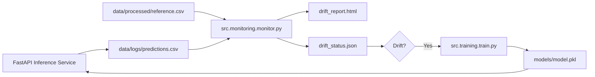

# MLOps Project 3 — Monitoring, Drift Detection, and Automated Retraining

This project implements a production-style MLOps workflow focused on real-time monitoring and automated retraining. A FastAPI-based inference service logs prediction data, which is analyzed using Evidently to detect drift between production and training reference distributions. When drift is detected, an automated retraining pipeline updates the model artifact. A GitHub Actions workflow runs monitoring and retraining on a schedule to simulate continuous training in a real-world MLOps environment.

---

# Features

This project includes:

- Monitoring pipeline using Evidently
- Data drift detection between training reference and production logs
- Machine-readable drift signal via JSON
- Automated retraining pipeline
- MLflow experiment tracking (local environment)
- FastAPI inference service (from Project 2)
- GitHub Actions workflow for scheduled monitoring and retraining
- Modular project structure appropriate for production MLOps workflows

---

# How to Run Locally

## 1. Set up virtual environment and install dependencies

```bash
python3 -m venv .venv
source .venv/bin/activate
pip install -r requirements.txt
```

---

## 2. Train the initial model

```bash
python src/training/train.py
```

This generates:

- models/model.pkl
- data/processed/reference.csv

---

## 3. Run the FastAPI inference service (optional for generating logs)

```bash
uvicorn src.inference.api:app --reload --port 8000
```

Use `/docs` to send prediction requests.

All requests are logged to:

- data/logs/predictions.csv

---

## 4. Run the monitoring pipeline

```bash
python src/monitoring/monitor.py
```

Outputs:

- reports/drift_report.html
- reports/drift_status.json

---

## 5. Run automated retraining

```bash
python src/training/retrain.py
```

If drift is detected, a new model is trained and saved to:

- models/model.pkl

MLflow logs metrics locally (not in CI environment).

---

# Run with GitHub Actions

A scheduled workflow automates:

- Monitoring
- Drift detection
- Conditional retraining

The workflow is located at:

```
.github/workflows/monitor-and-retrain.yml
```

It runs daily and can also be triggered manually.

---

# Architecture Overview

This project follows an MLOps architecture with dedicated components for:

- Inference and data logging
- Monitoring and drift detection
- Automated retraining
- Experiment tracking (local MLflow)
- CI/CD workflow orchestration

---

## High-Level Architecture Diagram



---

# Components

## Monitoring
- Uses Evidently to compare reference and production datasets
- Generates a full HTML drift report
- Produces a JSON drift flag used by the retraining pipeline

## Automated Retraining
- Reads `drift_status.json`
- Executes the training pipeline when drift is detected
- Saves updated model artifact to `models/model.pkl`
- MLflow logs metrics locally (disabled in CI)

## Inference (from Project 2)
- FastAPI service receives prediction requests
- Logs incoming data to support monitoring

## CI Automation
- GitHub Actions workflow runs monitoring and retraining
- Ensures continuous model evaluation and updating

---

# High-Level Data Flow

1. User sends prediction request to FastAPI  
2. Prediction input is logged to `predictions.csv`  
3. Monitoring job compares logs with `reference.csv`  
4. Evidently computes drift statistics  
5. Drift status is written to JSON  
6. Retraining pipeline executes if drift is detected  
7. Updated model replaces the previous model  
8. GitHub Actions automates this workflow daily  

---

# What I Learned / Skills Demonstrated

## MLOps
- Designing monitoring and drift detection workflows
- Building automated retraining pipelines
- Leveraging Evidently for statistical drift analysis

## ML Engineering
- Constructing reproducible training pipelines
- Managing model artifacts and reference datasets

## Experiment Tracking
- Logging metrics and artifacts with MLflow (local)

## DevOps / CI/CD
- Scheduling automated workflows using GitHub Actions
- Managing production-like monitoring and retraining loops

## Software Engineering
- Creating modular and maintainable project structures
- Building robust, scalable ML system components

---

# Project Status

- Drift monitoring implemented  
- Automated retraining operational  
- GitHub Actions automation functional  
- Documentation complete  

---

# End of File
